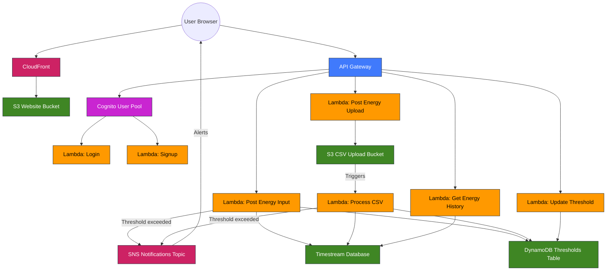

# AWS Architecture Diagram for Energy Management Application

This diagram illustrates the AWS service flow and integrations for the Energy Management Application.

## AWS Services Architecture

## Data Flow Description

1. **User Authentication Flow**:

   - Users authenticate through Cognito User Pool
   - Authentication handled by Login and Signup Lambda functions

2. **Energy Data Submission Flow**:

   - Users can submit energy data directly via API (Post Energy Input)
     - Writes time series data to Timestream database
     - Checks user thresholds from DynamoDB
     - Sends notifications via SNS if thresholds are exceeded
   - Users can upload CSV files (Post Energy Upload)
   - CSV files are stored in an S3 bucket

3. **CSV Processing Flow**:

   - S3 upload triggers the Process CSV Lambda function
   - Process CSV function:
     - Reads data from S3
     - Writes time series data to Timestream database
     - Checks user thresholds from DynamoDB
     - Sends notifications via SNS if thresholds are exceeded

4. **Data Retrieval Flow**:

   - Get Energy History retrieves time-series data from Timestream
   - Get All Items, Get By ID, and Update Threshold interact with DynamoDB

5. **Frontend Hosting**:
   - Vue.js application hosted in S3 bucket
   - Delivered via CloudFront distribution

## AWS Services Used

- **Amazon Cognito**: User authentication and management
- **Amazon API Gateway**: RESTful API endpoint management
- **AWS Lambda**: Serverless function execution
- **Amazon S3**: Static website hosting and CSV file storage
- **Amazon DynamoDB**: NoSQL database for thresholds and user settings
- **Amazon Timestream**: Time series database for energy consumption data
- **Amazon SNS**: Notification service for alerts
- **Amazon CloudFront**: CDN for website content delivery
